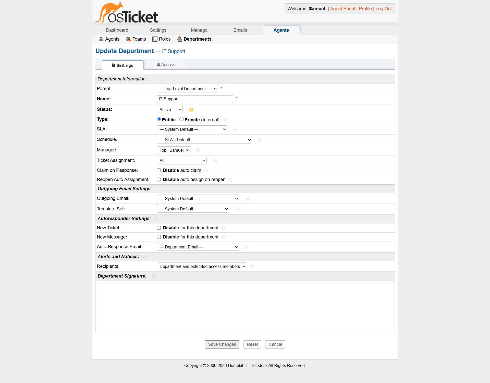
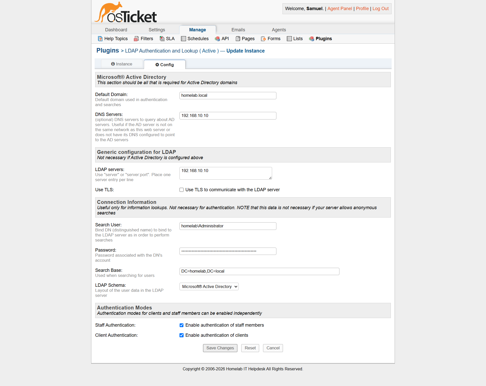
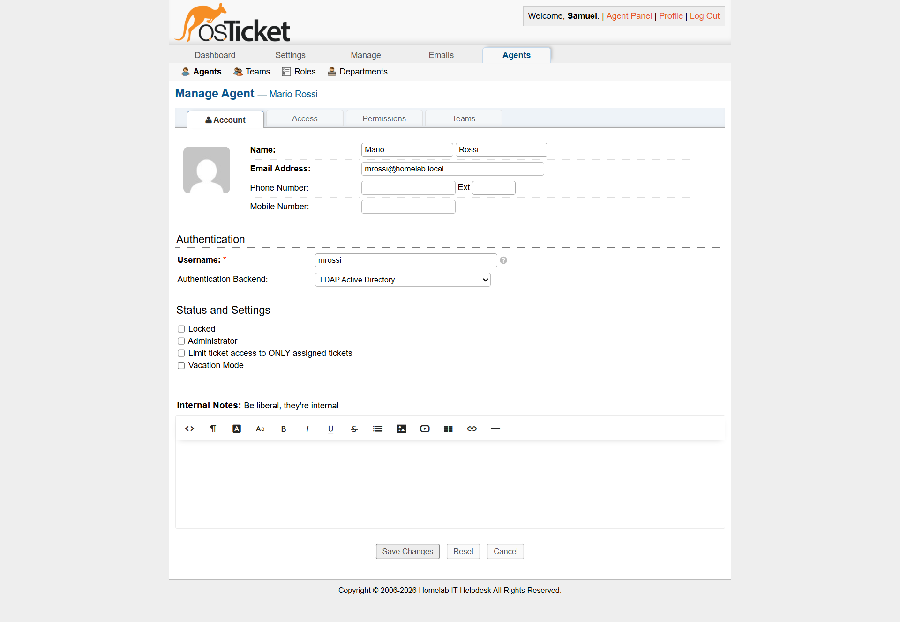

# 🎫 osTicket Ticketing System Homelab

## 🎯 Objective

This laboratory is planned to simulate an enterprise-grade IT Helpdesk / Service Desk ticketing workflow. The goal is to deploy an open-source ticketing platform (osTicket) on Linux, model standard ITIL processes (ticket intake, classification, SLA assignments, internal resolution notes, and closure), and eventually configure Active Directory LDAP integration to allow centralized credentials logins.

---

## 🏗️ Planned Architecture

The system runs on an Ubuntu Server VM. Since it needs to download packages from the internet (via VirtualBox NAT) and communicate with the Domain Controller and Client on the internal subnet (`192.168.10.0/24`), it is configured with **dual Network Interfaces (NICs)**.

```
                      [ VM Network: 192.168.10.0/24 ]
                                   │
         ┌─────────────────────────┼─────────────────────────┐
         │                         │                         │
┌────────┴────────┐       ┌────────┴────────┐       ┌────────┴────────┐
│  Domain Controller      │  Client Machine  │      │ Ticketing Server│
│      [DC-01]    │       │    [CLI-W11]    │       │  [osticket-srv] │
│                 │       │                 │       │                 │
│ Win Server 2022 │       │ Windows 11 Ent  │       │ Ubuntu 22.04 LTS│
│ IP: 192.168.10.10│      │ IP: 192.168.10.20│      │ NIC 1: 10.0.2.15│
│ AD DS, DNS      │       │ DNS: 192.168.10.10│     │ NIC 2: 192.168.10.30
└─────────────────┘       └─────────────────┘       └─────────────────┘
```

### VM Specifications

* **Host Name:** `osticket-srv`
* **OS:** Ubuntu Server 22.04 LTS (Long Term Support)
* **Hardware:** 1 vCPU, 2 GB RAM, 30 GB HDD
* **Network Interfaces:**
  * **NIC 1 (NAT):** `10.0.2.15/24` (For internet connectivity/LAMP package installation)
  * **NIC 2 (Internal - Static):** `192.168.10.30/24` (For internal lab communication and Active Directory LDAP integration)
* **Software Stack (LAMP):**
  * **Web Server:** Apache2
  * **Database:** MySQL Server
  * **Scripting:** PHP (with modules: `php-mysql`, `php-gd`, `php-imap`, `php-xml`, `php-mbstring`, etc.)
  * **Application:** osTicket (latest stable release)

---

## 📋 Scheduled Implementation Steps

### Phase 1: Linux Server Setup & LAMP Stack Deployment

1. Provision the Ubuntu Server VM (`osticket-srv`) inside VirtualBox, assigning NIC 1 to NAT and NIC 2 to the internal network. Configure static IP `192.168.10.30` on NIC 2.
2. **Configure SSH Access from Windows Host (Optional):**
   * Ensure SSH is running on the VM: `sudo apt update && sudo apt install openssh-server -y`.
   * Configure Port Forwarding in VirtualBox settings for **NIC 1 (NAT)**:
     * Rule: Protocol `TCP`, Host IP `127.0.0.1`, Host Port `2222`, Guest IP *leave empty* (or `10.0.2.15`), Guest Port `22`.
   * Connect from the Windows Host via Windows Terminal (PowerShell):

     ```powershell
     ssh admin_srv@127.0.0.1 -p 2222
     ```
3. Update repository lists and install packages:

   ```bash
   sudo apt update && sudo apt upgrade -y
   sudo apt install apache2 mysql-server php php-mysql php-gd php-imap php-xml php-mbstring php-intl php-apcu unzip wget -y
   ```
4. Secure and configure MySQL database, creating a dedicated user and database schema:

   ```sql
   CREATE DATABASE osticket_db;
   CREATE USER 'osticket_user'@'localhost' IDENTIFIED BY 'Password123!';
   GRANT ALL PRIVILEGES ON osticket_db.* TO 'osticket_user'@'localhost';
   FLUSH PRIVILEGES;
   ```

### Phase 2: osTicket Application Setup

1. Download and extract osTicket source files into the Apache web root: `/var/www/html/osticket`.
2. Configure permissions and copy template config file:

   ```bash
   sudo chown -R www-data:www-data /var/www/html/osticket
   ```
3. Access the setup wizard from the client browser (`http://192.168.10.30/osticket`) and input the database credentials and administrator profile.
4. Configured Support Departments and routing rules based on Help Topics.



### Phase 3: Helpdesk Ticket Simulation & Resolution (Real-World Case)

To demonstrate operational ticketing management aligning with ITIL guidelines, a real-world ticket was simulated, managed, and resolved within the platform:

#### **Scenario: Internet Connection Failure (User: Giulia Bianchi - Sales Department)**

* **Ticket Intake:** The user opened a support ticket via the public osTicket portal, selecting the **"Network Connectivity / Internet Issue"** help topic. The system automatically routed the ticket to the **IT Support** department and escalated the priority to **High** (Urgent SLA: 4-hour resolution window).
* **Ticket Assignment:** The IT Agent (`admin_desk`) claimed the ticket using the Staff Control Panel (`/scp`).
* **Diagnosis & Troubleshooting (Client Workstation CLI-W11):**
  1. Opened PowerShell on the client machine and verified the network interface configuration:

     ```powershell
     ipconfig /all
     ```

     *Diagnosis:* The workstation did not have a valid IP address assigned by the local DHCP server (showing an autoconfigured APIPA address `169.254.x.x`).
  2. Forced a DHCP lease release and renewal:

     ```powershell
     ipconfig /release
     ipconfig /renew
     ```
  3. Tested local connectivity and external DNS resolution:

     ```powershell
     ping 192.168.10.10   # Local ping to Domain Controller
     nslookup google.com  # Verify external DNS resolution
     ```
* **Ticket Closure:** The agent replied to the user via osTicket detailing the actions taken and updated the ticket status to **Closed / Resolved**.

### Phase 4: Active Directory LDAP Integration

* LDAP Server IP: `192.168.10.10`.
* Installed and configured the osTicket LDAP plugin.



* Mapped staff and client accounts to the AD domain `homelab.local`. To allow an agent to log in with domain credentials, the account is created in osTicket and mapped to the LDAP authentication backend.



* Verified Single Sign-On (SSO) login flow — **Successfully completed for user `mrossi`**.

#### 🔍 LDAP & Session Troubleshooting Log

During the LDAP integration, the following critical issues were identified and resolved:

1. **DNS Resolution of `homelab.local` Failed (SERVFAIL):**

   * *Cause:* The Ubuntu server queried the public DNS of the NAT interface (`enp0s3`) instead of the Domain Controller (`192.168.10.10`).
   * *Solution:* Modified the Netplan configuration `/etc/netplan/50-cloud-init.yaml` to add `nameservers` pointing to `192.168.10.10` on the internal interface `enp0s8`:

     ```yaml
     enp0s8:
      dhcp4: no
      addresses:
       - 192.168.10.30/24
      nameservers:
       addresses:
        - 192.168.10.10
       search:
        - homelab.local
     ```

     Applied settings with `sudo netplan apply`.

2. **Login Loop "Session timed out due to inactivity" (HTTP/SameSite Bug):**

   * *Cause:* With iframe allowance enabled, osTicket sets the session cookie with `SameSite=None`. Modern browsers block cookies configured with `SameSite=None` on unencrypted HTTP connections (which lack the `Secure` flag).
   * *Solution:* Patched `/var/www/html/osticket/include/class.ostsession.php` at line 263 to enforce `Lax` instead of `None` for HTTP connections:

     ```php
     'samesite' => !empty($ost->getConfig()->getAllowIframes()) ? 'Lax' : 'Strict'
     ```

     Restarted Apache (`sudo systemctl restart apache2`) and truncated active sessions (`TRUNCATE TABLE ost_session;`).

3. **"Access Denied" Error on Mario Rossi (`mrossi`) Login:**

   * *Cause:* The Active Directory account had "User must change password at next logon" enabled, which blocks LDAP authentication. Additionally, the Search User credentials in the LDAP plugin configurations were incorrect (using the `Administrators` group instead of the user).
   * *Solution:* Disabled the password reset flag on the Domain Controller (via ADUC or PowerShell `Set-ADUser -Identity mrossi -ChangePasswordAtLogon $false`) and set a known password (`HomelabHR2026!`). Configured the LDAP instance using `homelab\mrossi` as the working Search User.

---

## 🛠️ Demonstrated Core Competencies

* **Linux Systems Administration:** Secure CLI navigation, package management, daemon control, and file system permissions.
* **LAMP Stack Configuration:** Web server virtual hosts, relational database provisioning, and PHP extension management.
* **Service Desk Workflows:** ITIL alignment, incident classification, SLA target monitoring, and technical communication.
